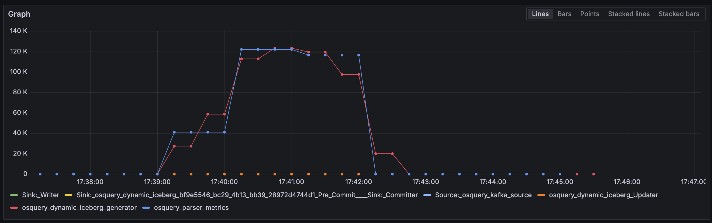
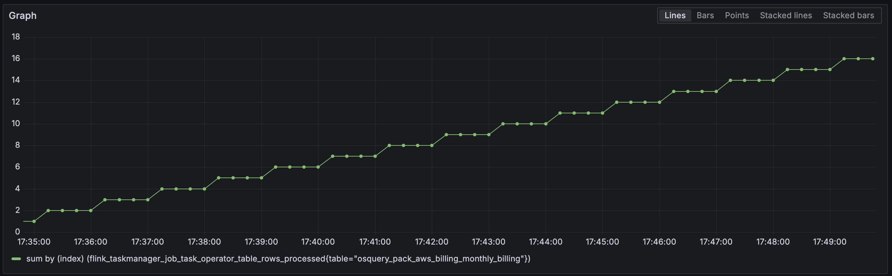
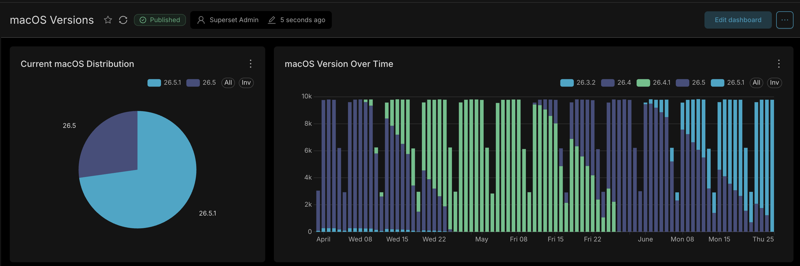
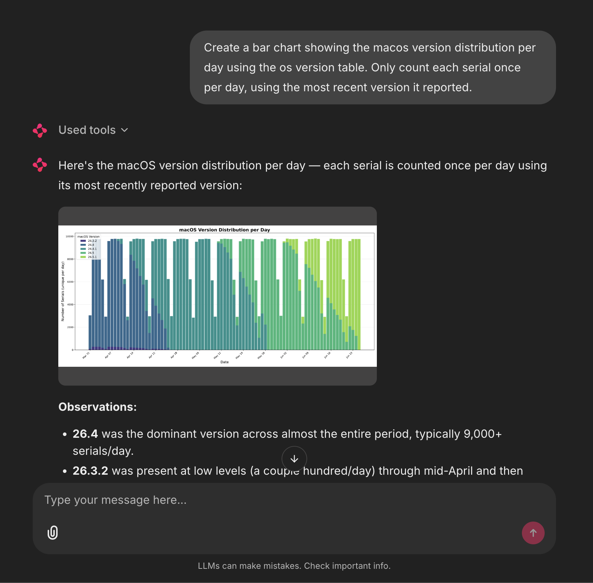

# About

This repo is a companion to the talk I gave at [MDOYVR](https://mdoyvr.com/) 2026, *osquery + AI: Device Insights at Scale*.

- [Talk Recording](https://www.youtube.com/watch?v=-6MX4qGK7gc)
- [Slide Deck](https://docs.google.com/presentation/d/13Li7k0-EJba--i1Zu_HoWln-FMSQKGUjOIE-yMtgrSE)

This repo contains a fully self-contained demo that ingests [osquery](https://osquery.io/) events into an open source data warehousem and provides multiple query interfaces - [Superset](https://superset.apache.org/) dashboards, an MCP server for AI agents, and a chat frontend to query the data with natural language.

### Not a Product

This repo is a **demo only**. It is not security hardened, performance optimized, or production ready in any way. It runs on a single EC2 instance, uses auto-generated passwords, and is not designed for multi-tenant access. Use at your own risk.


## What's in This Repo

| Directory | Description |
|-----------|-------------|
| [`terraform/`](terraform/) | AWS infrastructure (VPC, EC2, Cloudflare DNS) and cluster bootstrap scripts |
| [`charts/`](charts/) | Helm charts for every component, plus App-of-Apps compositions for Argo CD |
| [`images/`](images/) | Container images and source code for the four custom images built in-cluster |
| [`osquery-extension/`](osquery-extension/) | Demo Go osquery extension |
| [`scripts/`](scripts/) | SSH/kubectl helpers, health checker, and demo scripts |
| [`synthetic_data/`](synthetic_data/) | Sample device data for testing |
| [`docs/`](docs/) | Diagrams and screenshots used in this doc |


### Component Details

| Component | What It Does | Docs |
|-----------|-------------|------|
| **Garage** | [Garage](https://garagehq.deuxfleurs.fr/) - S3-compatible distributed object store. Holds the raw Parquet/ORC data files that make up the Iceberg tables. Flink writes here; Trino reads from it. | [charts/README.md](charts/README.md) |
| **Kafka** | [Apache Kafka](https://kafka.apache.org/) - event streaming broker. osquery agents publish JSON log events to the `osquery` topic over mTLS, and Flink consumes from this same topic. | [charts/README.md](charts/README.md) |
| **Flink** | [Apache Flink](https://flink.apache.org/) streaming job. Consumes osquery events from Kafka, parses the JSON payload, and writes each osquery table name as a separate Iceberg table with automatic schema evolution. Flink also exports custom metrics about the data. | [images/flink-osquery-job/README.md](images/flink-osquery-job/README.md) |
| **Polaris** | [Apache Polaris](https://polaris.apache.org/) - the Iceberg REST catalog. Stores table metadata (schema, partition spec, snapshot history) in a PostgreSQL database. Flink registers tables here; Trino connects to it to discover and query Iceberg tables. | [charts/README.md](charts/README.md) |
| **Trino** | [Trino](https://trino.io/) - distributed SQL query engine. Connects to Polaris for table metadata and Garage for data files, exposing the Iceberg lake as standard SQL tables. The demo also runs hourly compaction and daily snapshot cleanup CronJobs against Trino. All downstream consumers (Superset, MCP Server, Iceberg maintenance) query through Trino. | [charts/README.md](charts/README.md) |
| **Superset** | [Apache Superset](https://superset.apache.org/) BI dashboard, pre-connected to the Trino Iceberg catalog. Use it to build charts, dashboards, and ad-hoc SQL queries against the osquery data lake. | [images/superset/README.md](images/superset/README.md) |
| **MCP Server** | [Model Context Protocol](https://modelcontextprotocol.io/) (MCP) server written in Go. Provides tools to query via Trino, and an isolated sandbox to generate charts via Python. | [images/data-warehouse-mcp/README.md](images/data-warehouse-mcp/README.md) |
| **DWH Chat** | Conversational AI frontend built on [Chainlit](https://chainlit.io/). Users type natural-language questions; the LLM generates SQL, sends it to the MCP server for execution, and renders inline charts from sandboxed Python. Chat history is persisted in PostgreSQL. | [images/dwh-chat/README.md](images/dwh-chat/README.md) |
| **osquery Extension** | Demo [osquery](https://osquery.io/) Go extension that adds a sample `aws_billing` table. | [osquery-extension/README.md](osquery-extension/README.md) |


### Architecture


## Getting Started

### Prerequisites

- **AWS account** with permissions to create VPC, EC2, IAM roles, and security groups
  - [Create an AWS account](https://aws.amazon.com/free/) if you don't have one
  - Configure credentials locally: `aws login` or set `AWS_ACCESS_KEY_ID` / `AWS_SECRET_ACCESS_KEY`
- **OpenTofu** (or Terraform) CLI
  - `brew install opentofu`
- **AWS CLI** (for `aws login`)
  - `brew install awscli`
- **Cloudflare account** - provides DNS and DNS API for Let's Encrypt DNS-01 certificates
  - [Sign up for Cloudflare](https://dash.cloudflare.com/sign-up)
  - Purchase a domain from Cloudflare or add your domain to Cloudflare and update your domain's nameservers
  - Create a Cloudflare API token with DNS edit + zone read permissions: [Cloudflare API tokens docs](https://developers.cloudflare.com/fundamentals/api/get-started/create-token/)
- **Git repo access (optional)** - If you're cloning this repo to a private repo, Argo CD needs a username/token for access
  - For GitHub: [Personal access tokens](https://docs.github.com/en/authentication/keeping-your-account-and-data-secure/managing-your-personal-access-tokens)
- **osquery** installed locally (to send events into the demo)
  - `brew install --cask osquery`
- **Go 1.24+** (to build the osquery extension)
  - `brew install go`
- **Python 3.12+** with `confluent-kafka` (for the synthetic data scenario)
  - `pip install confluent-kafka`
- **AI API endpoint** (for DWH Chat)
  - DWH Chat connects to any OpenAI-compatible API. You'll need a base URL, model ID(s), and (optionally) an API key configured in `terraform.tfvars` under `dwh_chat.endpoints`
  - Examples:
    - [OpenRouter](https://openrouter.ai/) - unified API with access to 100+ models (free tier available)
    - [Open Code Go](https://opencode.go/) - open-source local model gateway
  - See [images/dwh-chat/README.md](images/dwh-chat/README.md) for the `endpoints.yaml` format

### 1. Configure Terraform Variables

```bash
cd terraform
cp terraform.tfvars.example terraform.tfvars
# Edit terraform.tfvars with your credential and domain values
```

See [terraform/README.md](terraform/README.md) for the full variable reference.

### 2. Provision Infrastructure

```bash
cd terraform
tofu init
tofu apply
```

> **Cost warning:** The default `m8a.xlarge` instance costs ~$6/day while running. Remember to run `tofu destroy` or shut down the instance when you're done to avoid unexpected charges.

This creates the EC2 instance and triggers user-data bootstrapping, which:
1. Installs **[k3s](https://k3s.io)** (lightweight Kubernetes)
2. Installs **[Argo CD](https://argo-cd.readthedocs.io)** (GitOps controller)
3. Applies the `charts/cluster-resources` Helm chart, which deploys the entire stack

### 3. Verify the Cluster Is Healthy

```bash
./scripts/health_check.sh
```

This script monitors all 10 bootstrap phases: DNS, SSH, k3s, Argo CD, every sync wave, image builds, TLS certificates, and ingress endpoints.

Full deployment takes ~15-20 minutes on the default `m8a.xlarge` instance type. The in-cluster `build-images` chart compiles four Docker images during this time.

### 4. Access Demo Services

Once healthy, the following services are available via HTTPS at subdomains of your configured domain. All services are protected by HTTP Basic Auth (username: `admin`, password: the value you set for `admin_password` in `terraform.tfvars`).


| Service | Subdomain | Description |
|---------|-----------|-------------|
| **Argo CD** | `argo.<DOMAIN>` | ArgoCD Web UI |
| **Superset** | `superset.<DOMAIN>` | Superset Web UI (requires its own login after Basic Auth: `admin` / `admin`) |
| **DWH Chat** | `chat.<DOMAIN>` | Conversational AI chat Web UI |
| **MCP Server** | `chat.<DOMAIN>/images` | Images endpoint for sharing images in DWH Chat |
| **Flink** | `flink.<DOMAIN>` | Flink Web UI |
| **Grafana** | `grafana.<DOMAIN>` | Grafana Web UI |


> Replace `<DOMAIN>` with your Cloudflare zone (e.g., `chat.example.com`).

### 5. Demo: Send osquery Events

[osquery](https://osquery.io/) supports [custom extensions](https://osquery.readthedocs.io/en/latest/extensions/overview/) that add new queryable tables beyond the built-in ones. This demo includes a sample extension written in Go using the [osquery-go](https://github.com/osquery/osquery-go) SDK, which exposes an `aws_billing` table backed by the AWS Cost Explorer API.

To demo the osquery-extension `aws_billing` table streaming events to the data lake, run the following script from your local machine:

```bash
# make sure you have an active aws session
aws login
./scripts/run_osquery.sh
```

This script:
1. Resolves the Kafka broker address from Terraform output
2. Downloads the mTLS client certificate from the cluster
3. Builds the `aws_billing` osquery extension
4. Launches `osqueryd` with Kafka logging, the billing pack, and serial decorators

`osqueryd` will send an event every 60 seconds, which you can monitor with `python3 ./scripts/kafka_consumer.py`.

Flink streams events from Kafka in real-time, writing to Iceberg tables every 60 seconds. After that, events are queryable via Trino, Superset, or DWH Chat.

### 6. Demo: Run the OS Update Scenario

For a larger, more realistic demo, use the built-in OS update scenario to simulate a fleet-wide OS rollout:

```bash
pip install confluent-kafka
python3 ./scripts/os_update_scenario.py
```

This script simulates **10,000 devices** over a 3-month window (April–June 2026), generating synthetic `os_version` osquery events that model a staged OS upgrade rollout.
The events are streamed to Kafka just like osquery would.

The script generates ~5.5M events. On the default `m8a.xlarge` instance, Flink can sustain ~120k events/second, so the dataset becomes fully queryable within 1-2 minutes.

## Exploring the Data

### Flink Metrics in Grafana

The Flink job exports per-table and job-level metrics to Prometheus, which Grafana visualizes.

1. Open Grafana at `https://grafana.<DOMAIN>/explore`
2. Click the `Code` tab to enter PromQL queries
3. Run the queries below to inspect ingestion health:

**Event ingestion rate by task**

```
sum by(task_name) (rate(flink_taskmanager_job_task_numRecordsIn[2m]))
```

Shows Flink's per-task record ingestion rate, useful to see which task within the Flink job is the bottleneck.



**Rows processed for a specific Iceberg table**

```
sum by (index) (flink_taskmanager_job_task_operator_table_rows_processed{table="osquery_pack_aws_billing_monthly_billing"})
```

Tracks cumulative rows written per incoming osquery table; in this case, the table from the aws_billing extension.



### OS Version Chart in Superset

A demo dashboard with pre-built charts is created automatically on deploy. Open it at `superset.<DOMAIN>/superset/dashboard/1/` (log in with `admin` / `admin`).



You can also run ad-hoc SQL queries against the `osquery_os_version` table, for example:

```sql
WITH latest_per_day AS (
    SELECT
      DATE_TRUNC('DAY', CAST(meta_time AS TIMESTAMP)) AS meta_time,
      decoration_serial,
      version,
      ROW_NUMBER() OVER (
        PARTITION BY decoration_serial, DATE_TRUNC('DAY', CAST(meta_time AS TIMESTAMP))
        ORDER BY meta_time DESC
      ) AS rn
    FROM iceberg.default.osquery_os_version
  )
  SELECT
    meta_time,
    version,
    COUNT(decoration_serial)
  FROM latest_per_day
  WHERE rn = 1
    AND meta_time > CAST('2026-06-19' AS TIMESTAMP)
  GROUP BY meta_time, version
  ORDER BY meta_time, version ASC
```

### Querying with DWH Chat

DWH Chat lets you query the data lake conversationally. The LLM can query the data warehouse, and build charts using Python.

1. Open DWH Chat at `chat.<DOMAIN>`
2. Try a question like:

> "Create a bar chart showing the macos version distribution per day using the os version table. Only count each serial once per day, using the most recent version it reported."

3. The chat will query the data and output a chart:



## More Documentation

- **[Terraform Setup](terraform/README.md)** - AWS infrastructure, variables, and destroy instructions
- **[Helm Charts](charts/README.md)** - Full chart catalog, sync-wave ordering, and component details
- **[Flink Osquery Job](images/flink-osquery-job/README.md)** - Streaming ingestion architecture and config
- **[MCP Server](images/data-warehouse-mcp/README.md)** - Tool reference, endpoints, and configuration
- **[DWH Chat](images/dwh-chat/README.md)** - Chat features, LLM endpoints config
- **[Osquery Extension](osquery-extension/README.md)** - AWS billing table schema and usage
